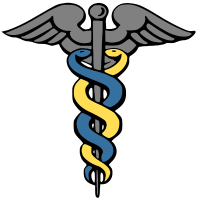

# VA_COVID-19_NLP
An NLP pipeline for COVID-19 surveillance used in the Department of Veterans Affairs Biosurveillance.
This system is described in [A Natural Language Processing System for National COVID-19 Surveillance in the US Department of Veterans Affairs](https://openreview.net/forum?id=ZQ_HvBxcdCv)
by Chapman et al as part of the [ACL COVID-19 Emergency Workshop](https://www.nlpcovid19workshop.org/).

Our system was deployed as part of the VA response to the COVID-19 pandemic and has helped to identify a large number
of COVID-19 cases in the national VA healthcare system.

## Disclaimer
This repository its not meant to be a complete, finalized system for detection of COVID-19 in clinical text.
It was developed in the US Department of Veterans Affairs for a specific operational goal. However, performance will vary 
based on your data and use case. This is also not the exact system described in the paper above - it has been modified and 
simplified to be generalizable rather than being extremely specific to VA data.
 
You will likely need to customize your pipeline based on your data and needs. But hopefully we've made that easy to do! 
The tutorials in [./notebooks](./notebooks) show how each component works, how you can add new rules, and how to remove/add
components to the pipeline.

# Overview
This repository implements a version of the system described in [A Natural Language Processing System for National COVID-19 Surveillance in the US Department of Veterans Affairs](https://openreview.net/forum?id=ZQ_HvBxcdCv).

The NLP system is designed as a [spaCy](https://spacy.io/) processing pipeline. Most components are implemented as part of the
[medSpaCy](https://github.com/medspacy/medspacy) package. 



The pipeline consists of the following main pieces:
1. Custom components imported from medSpaCy
2. A document classifier component which assigns the attribute `doc._.cov_classification` indicating whether a document 
**"POS"**, **"UNK"**, or **"NEG"** for COVID-19
3. A knowledge base containing rules which are added to the components and control which entities are extracted and what
attributes are assigned

# Usage
A detailed tutorial and explanation is provided in [./notebooks](./notebooks).

## Installation

You can install `cov_bsv` by cloning this repository and installing using `setup.py`:
```bash
$ python setup.py install
```

Once you've installed all the dependencies, you'll need to install the spaCy language model **en_core_web_sm**:
```bash
$ python -m spacy download en_core_web_sm
```

**cov_bsv requires Python>=3.6**

## Quick Start
Below is a simple example which takes a clinical text, loads a pipeline with the knowledge base, and processes the text.
We can then inspect the document classification and linguistic patterns extracted from the text using visualization 
functions from `cov_bsv` and `medspacy`.
```python
import cov_bsv

nlp = cov_bsv.load(model="default", load_rules=True)
text = """
Patient presents to rule out COVID-19. 
His wife recently tested positive for novel coronavirus.​

COVID-19 results pending.​
"""

doc = nlp(text)

cov_bsv.visualize_doc(doc)
```


```python
from medspacy.visualization import visualize_dep
doc = nlp("His wife recently tested positive for novel coronavirus.​")
visualize_dep(doc)
```


# Contact Information
If you have any questions or comments, or if you have applied NLP to help combat the COVID-19 pandemic,
we'd love to hear from you! Feel free to reach out using the contact information below.
- **Primary Developer:** Alec Chapman
- **Email Address:** alec.chapman@hsc.utah.edu
